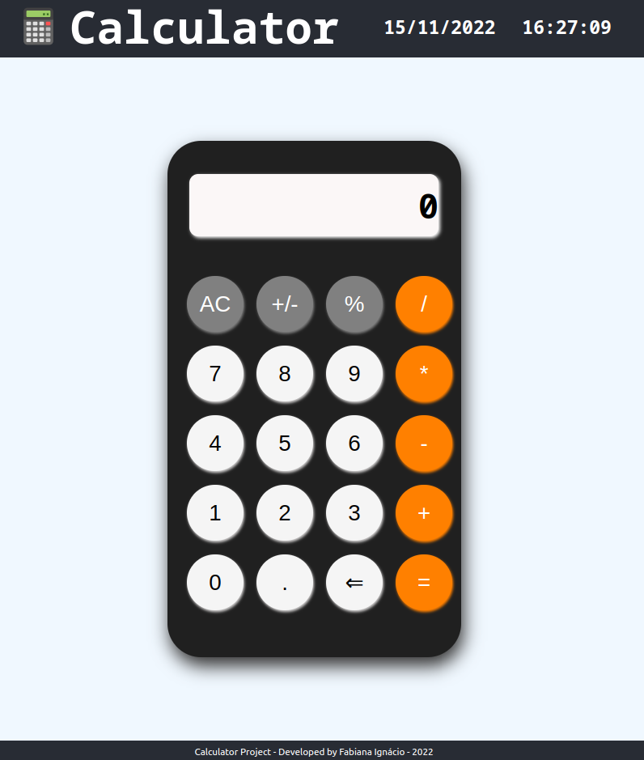

# Projeto Calculadora :heavy_plus_sign: :heavy_minus_sign: :heavy_multiplication_x: :heavy_division_sign:

## :memo: Descrição

Projeto calculadora utilizando React.

## :books: Funcionalidades
* <b>Funcionalidade </b>: A aplicação simula as operações básicas de uma calculadora simples e ainda incluir no header a data atual e um relógio atualizando em tempo real. 
:date: 
:clock5:

## :wrench: Tecnologias utilizadas
* JavaScript;
* React;
* HTML;
* CSS;

## :soon: Implementação futura
* tornar a aplicação responsiva

